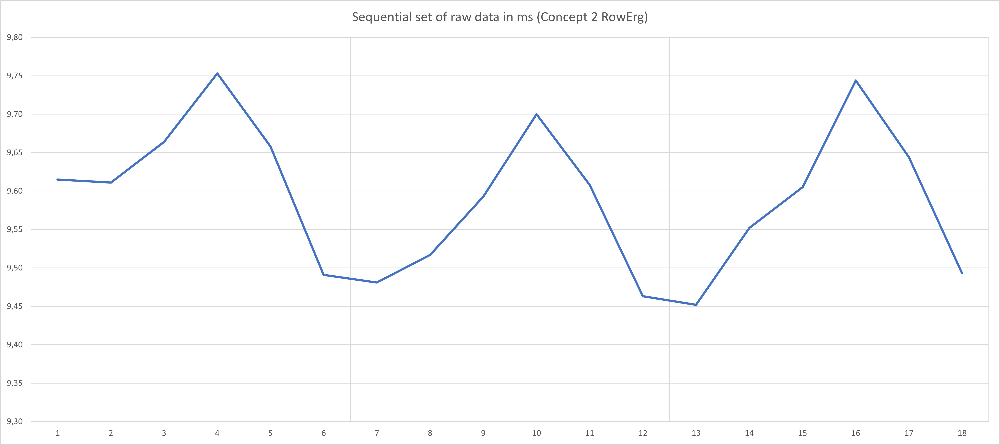

# The mathematics of OpenRowingMonitor

<!-- markdownlint-disable no-inline-html -->
In this document we explain the math behind the OpenRowingMonitor, to allow for independent review and software maintenance. It should be read in conjunction with [our desciption of OpenRowingMonitor's physics](./physics_openrowingmonitor.md), as these interact. When possible, we link to the source code to allow further investigation and keep the link with the actual implementation.

Please note that this text is used as a rationale for design decissions of the mathematical algorithms used in OpenRowingMonitor. So it is of interest for people maintaining the code (as it explains why we do things the way we do) and for academics to verify or improve our solution. For these academics, we conclude with a section of open design issues as they might provide avenues of future research. If you are interested in just using OpenRowingMonitor as-is, this might not be the text you are looking for.

This document consists out of four sections:

* [A description of the leading design principles of the mathematic algorithms](#leading-design-principles-of-the-mathematic-algorithms)
* [An overview of the places where specific algorithms are used](#overview-of-algorithms-used)
* [The selection and/or design of the specific mathematical algorithms used](#the-selection-and-design-of-used-mathematical-algorithms)
* [Open design issues](#open-design-issues)

## Leading design principles of the mathematic algorithms

In our design of the physics engine, we obey the following principles (see also [the architecture document](Architecture.md)):

* all calculations should be performed in real-time in a stream of datapoints, even on data intensive machines, to allow decent feedback to the user. The losd on the CPU is to be limited as some rowing machines are data intensive and the app's CPU load interferes with the accurate measurement of time between pulses by the responsible kernel functions;

* stay as close to the original data as possible (thus depend on direct measurements as much as possible) instead of heavily depend on derived data. This means that there are two absolute values we try to stay close to as much as possible: the **time between an impulse** and the **Number of Impulses**, where we consider **Number of Impulses** most reliable, and **time between an impulse** reliable but containing noise (the origin and meaning of these metrics, as well the effects of this approach are explained later);

* use robust calculations wherever possible (i.e. not depend on a single measurements, extrapolations, derivation, etc.) to reduce effects of measurement errors. A typical issue is the role of *CurrentDt*, which is often used as a divisor with small numers as &Delta;t, increasing the effect of measurement errors in most metrics. When we do need to calculate a derived function, we choose to use a robust linear regression method to reduce the impact of noise and than use the function to calculate the derived function;

## Overview of algorithms used

### Noise filtering on CurrentDt

In [`Flywheel.js`](..//app/engine/Flywheel.js) there is a noise filter present, essentially to handle edge cases and for legacy purposses. In theory this should be removed as the subsequent handling by robust algorithms is actually disturbed when this filter is applied.

### Linear regression algorithm for dragfactor calculation based on *CurrentDt* and time

In [`Flywheel.js`](..//app/engine/Flywheel.js) the recovery slope is determined. Theoretically, this should be a line following:

$$ {k \* 2&pi; \over I \* Impulses Per Rotation} = {&Delta;currentDt \over &Delta;t} $$

This is expected to be a straight line, where its slope is essentially the dragfactor multiplied by a constant. For the drag-factor calculation (and the closely related recovery slope detection), we observe four things:

* As this tends to be a serious set of datapoints (over 200 for a Concept2), higher polynomial algorithms are not considered applicable. As the dragfactor is essential for all linear metrics, it is crucial it is robust against noise;

* The number of datapoints in the recovery phase isn't known in advance, and is subject to significant change due to variations in recovery time (i.e. sprints), making the Incomplete Theil–Sen estimator incapable of calculating their slopes in the stream as the efficient implementations require a fixed window. OLS has a O(1) complexity for continous datastreams, and has proven to be sufficiently robust for most practical use. Using the Linear Theil-sen estimator results in a near O(N) calculation at the start of the *Drive* phase (where N is the length of the recovery in datapoints). The Quadratic Theil-sen estimator results in a O(N2) calculation at the start of the *Drive* phase. Given the number of datapoints often encountered (a recoveryphase on a Concept 2 contains around 200 datapoints), this is a significant CPU-load that could disrupt the application;

* In non-time critical replays of earlier recorded rowing sessions, both the Incomplete Theil–Sen estimator performed worse than OLS: OLS with a high pass filter on r2 resulted in a much more stable dragfactor than the Incomplete Theil–Sen estimator did. The Theil–Sen estimator, in combination with a filter on r2 has shown to be even a bit more robust than OLS. This suggests that the OLS algorithm combined with a requirement for a sufficiently high r2 handles the outliers sufficiently to prevent drag poisoning and thus provide a stable dragfactor for all calculations. The Linear Theil-Sen estimator outperfomed OLS by a small margin, but noticeably improved stroke detection where OLS could not regardless of parameterisation.

* Applying Quadratic OLS regression does not improve its results when compared to Linear OLS regression or Linear TS. For the drag (and thus recovery slope) calculation, the Linear Theil-Sen estimator has a slightly better performance then OLS, while keeping CPU-load acceptable for a data-intensive rowing machine (Concept 2, 12 datapoints flank, 200 datapoints in the recovery). A Quadratic theil-Sen based drag calculation has shown to be too CPU-intensive. For the stroke detection itself, OLS and Linear Theil-Sen deliver the same results, while OLS is less CPU intensive.

* Use of trimming, for example to prevent heads or tails of the drive entering the drag-calculation has negative effects. Where a test sample (a Concept2 RowErg on drag 68, which is the most difficult for OpenRowingMonitor) the recovery slope with the current algorithm has an R2 of 0.96, applying trimming reduced this to a R2 of 0.93, suggesting that trimming makes the fit worse instead of better;

Therefore, we choose to apply the Linear Theil-Sen estimator for the calculation of the dragfactor and the closely related recovery slope.

### Linear regression algorithms applied for recovery detection based on *CurrentDt* and time

We use OLS for the stroke detection.

### Regression algorithm used for Angular velocity &omega; and Angular Acceleration &alpha; based on the relation between &theta; and time

As *currentDt* only provides us with a position and time to work with, options for determining the values of &omega; and &alpha; are quite limited. The standard numerical approach of &omega; = ${&Delta;&theta; \over &Delta;t}$ and the subsequent &alpha; = ${&Delta;&omega; \over &Delta;t}$ are too inpricise and vulnerable to noise in *CurrentDt*. Tests show (see the test for the cubic function f(x) = x3 + 2x2 + 4x in [`flywheel.test.js`](../app/engine/Flywheel.test.js)) that in a artificial noise free series simulating a continuous accelerating flywheel, the underestimation varies but is significant:

| Test | &omega; | &alpha; |
|---|---|---|
| Noise free | -1.8% to -5% | -0.5% to -4.8% |
| Systematic noise (+/- 0.0001 sec error) | -1.95% to -2.66% | -11.05% to +9.69% |

As this table shows, the traditional numerical approach is too unstable to be usefull, especially for determining the angular acceleration &alpha; where the deviation from the theoretical value deviates wildly. In the presence of random noise, deviations become bigger and power and force curves contain several spikes. Abandoning the numerical approach for a regression based approach has resulted with a huge improvement in metric robustness, both in theory and practice.

We thus determine the Angular Velocity &omega; and Angular Acceleration &alpha; based on the regression of the function of &theta; and time, and then use the function's derivatives to determine angular velocity &omega; and angular acceleration &alpha;. The function of &theta; through time is quite dynamic: when a simple static force would be applied, &theta; would behave as 1/2 \* &alpha; \* t2 + &omega; \* t, a quadratic function with respect to time. As the force on the flywheel is quite dynamic throughout the stroke, this function would probably be a cubic, quartic or even quintic in reality. Also observe that we use both the first derived function (i.e. &omega;) and the second derived function (i.e. &alpha;), requiring at least a quadratic regression algorithm, as a liniear regressor would make the second derived function trivial.

Looking at the signals found in practice, we also observe specific issues, which could result in structurally overfitting the dataset if the polynomial would be too high, nihilating its noise reduction effect. As the following sample of three rotations of a Concept2 flywheel shows, due to production tolerances or deliberate design constructs, there are **systematic** errors in the data due to magnet placement or magnet polarity. This results in systematic issues in the datastream:

Deviation of the Concept 2 RowErg

Fitting a quadratic curve with at least two full rotations of data (in this case, 12 datapoints) seems to reduce the noise to very acceptable levels, forcing the algorithm to follow the trend, not the individual datapoints. In our view, fitting a third-degree polynomial would result in a better fit with the systematic errors, thus resulting in a much less robust signal. As a cubic regression analysis method will lead to overfitting certain error modes, we are constricted to quadratic regression analysis methods. By using a sliding window algorithm, using multiple quadratic approximations for angular velocity &omega; and angular acceleration &alpha; for the same datapoint, we aim to get close to a cubic regressors behaviour, without the overfitting.

@@@@@

So far, we were able to implement Quadratic Theil-Senn regression and get reliable and robust results. Currently, the use of Quadratic Theil-Senn regression represents a huge improvement from both the traditional numerical approach (as taken by [[1]](#1) and [[4]](#4)) used by earlier approaches of OpenRowingMonitor. In essence, it is a more advanced Moving Least Squares regression approach, where the regression method is Theil-Sen. Practical testing has confirmed that Quadratic Theil-Senn outperformed all Linear Regression methods in terms of robustness and responsiveness. Based on extensive testing with multiple simulated rowing machines, Quadratic Theil-Senn has proven to deliver the best results and thus is selected to determine &omega; and &alpha;.

The (implied) underlying assumption underpinning the use of Quadratic Theil-Senn regression approach is that the Angular Accelration &alpha; is constant, or near constant by approximation in the flank under measurment. In essence, quadratic Theil-Senn regression would be fitting if the acceleration would be a constant, and the relation of &theta;, &alpha; and &omega; thus would be captured in &theta; = 1/2 \* &alpha; \* t2 + &omega; \* t. We do realize that in rowing the Angular Accelration &alpha;, by nature of the rowing stroke, will vary based on the position in the Drive phase: the ideal force curve is a heystack, thus the force on the flywheel varies in time.

As the number of datapoints in a *Flanklength* in the relation to the total number of datapoints in a stroke is relatively small, we use quadratic Theil-Senn regression as an approximation on a smaller interval. In tests, quadratic regression has proven to outperform (i.e. less suspect to noise in the signal) both the numerical approach with noise filtering and the linear regression methods. When using the right efficient algorithm, this has the strong benefit of being robust to noise, at the cost of a O(n2) calculation per new datapoint (where n is the flanklength). Looking at the resulting fit of the Quadratic Theil-Sen estimator, we see that it consistently is above 0.98, which is an extremely good fit given the noise in the Concept 2 RowErg data. Therefore, we consider this is a sufficiently decent approximation while maintaining an sufficiently efficient algorithm to be able to process all data in the datastream in time.

Traditionally, the *Flanklength*, or the *bandwith* in a Moving Least Squares regression, is a balance between robustness against noise and its responsiveness to details (i.e. the bias-variance trade-off). It is important to realize that unlike many other implementations, the *Flanklength* is also highly determined by the presence of systematic repeating errors in the signal: bad placement of specific magnets on the flywheel. The typical advice is to use a *Flanklength* of twice the number of magnets, as that completely surpresses the effect repeated patterns present in the data, allowing the algorithm to correct it.

Although the determination of angular velocity &omega; and angular acceleration &alpha; based on Quadratic Theil-Senn regression over the time versus angular distance &theta; works decently, we realize it does not respect the true dynamic nature of angular acceleration &alpha;. From a pure mathematical perspective, a higher order polynomial would be more appropriate. A cubic regressor, or even better a fourth order polynomal have shown to be better mathematical approximation of the time versus distance function for a Concept2 RowErg. We can inmagine there are better suited third polynomal (cubic) approaches available that can robustly calculate &alpha; and &omega; as a function of time, based on the relation between time and &theta;. However, getting these to work in a datastream with very tight limitations on CPU-time and memory across many configurations is quite challenging.

However, there are some current practical objections against using these more complex methods:

* Higher order polynomials are less stable in nature, and overfitting is a real issue. As the displacement of magets can present itself as a sinoid-like curve (as the Concept 2 RowErg shows), 3rd or higher polynomials are inclined to follow that curve. As this might introduce wild shocks in our metrics, this might be a potential issue for application;
* A key limitation is the available number of datapoints. For the determination of a polynomial of the n-th order, you need at least n+1 datapoints (which in OpenRowingMonitor translates to a `flankLength`). Some rowers, for example the Sportstech WRX700, only deliver 5 to 6 datapoints for the entire drive phase, thus putting explicit limits on the number of datapoints available for such an approximation.
* Calculating a higher order polynomial in a robust way, for example by Theil-Senn regression, is CPU intensive. A quadratic approach requires a O(n2) calculation when a new datapoint is added to the sliding window (i.e. the flank). Our estimate is that with current known robust polynomial regression methods, a cubic approach requires at least a O(n3) calculation, and a 4th polynomial a O(n4) calculation. With smaller flanks (which determines the n) this has proven to be doable, but for machines which produce a lot of datapoints, and thus have more noise and a typically bigger `flankLength` (like the C2 RowErg and Nordictrack RX-800, both with a 12 `flankLength`), this becomes an issue: we consider completing 103 or even 104 complex calculations within the 5 miliseconds that is available before the next datapoint arrives, impossible.

We also observe that in several areas the theoretical best approach did not deliver the best practical result (i.e. a "better" algorithm delivered a more noisy result for &alpha; and &omega;). Therefore, this avenue isn't investigated yet, but will remain a continuing area of improvement.

This doesn't definitively exclude the use of more complex polynomial regression methods: alternative methods for higher polynomials within a datastream could be as CPU intensive as Theil-Senn Quadratic regression now, and their use could be isolated to specific combination of Raspberry hardware and settings. Thus, this choice for the specific algorithm will remain an active area of investigation for future versions.

## The selection and design of used mathematical algorithms

### Noise filtering algorithm

See [`/app/engine/utils/StreamFilter.js`](../app/engine/utils/StreamFilter.js)

For noise filtering, we use a moving median filter, which has the benefit of removing outliers completely. This is more robust than the moving average, where the effect of outliers is reduced, but not removed.

### Linear regression algorithms

There are several different linear regression methods [[9]](#9). We have several requirements on the algorithm:

* it has to delviver results in near-real-time scenarios in a datastream;

* if possible, it has to be robust to outliers: an outlier shouldn't skew the results too much [[10]](#10).

Ordinary Least Squares is by far the most efficient and can easily be applied to datastreams. However, it isn't robust. From a robustness perspective, most promissing methods are [least absolute deviations](https://en.wikipedia.org/wiki/Least_absolute_deviations), the [Theil–Sen estimator](https://en.wikipedia.org/wiki/Theil%E2%80%93Sen_estimator) and the [LASSO technique](https://en.wikipedia.org/wiki/Lasso_(statistics)). Most of these methods, except the Theil–Sen estimator, do not have a near-real-time solution. In the description of the linear regression methods, we describe the most promissing ones.

#### Ordinary Least Squares (OLS)

See [`/app/engine/utils/OLSLinearSeries.js`](../app/engine/utils/OLSLinearSeries.js)

Ordinary Least Squares regression (see [[5]](#5)) and [[6]](#6)) produces results that are generally acceptable and the O(N) performance is well-suited for near-real-time calculations. When implemented in a datastream, the addition of a new datapoint is O(1), and the calculation of a slope also is O(1). When using a high-pass filter on the r2 to disregard any unreliably approximated data, it can also be used to produce reliable results. See `engine/utils/OLSLinearSeries.js` for more information about the implementation.

#### Theil–Sen estimator (Linear TS)

See [`/app/engine/utils/FullTSLinearSeries.js`](../app/engine/utils/FullTSLinearSeries.js)

Although the Theil–Sen estimator has a O(N log(N)) solution available, however we could not find a readily available solution. We did manage to develop a solution that has a O(N) impact during the addition of an additional datapoint in a datastream with a fixed length window, and O(log(N)) impact when determining the slope.

### Polynomial regression algorithm

#### Quadratic Theil–Sen estimator (Quadratic TS)

See [`/app/engine/utils/FullTSQuadraticSeries.js`](../app/engine/utils/FullTSQuadraticSeries.js)

The Theil–Sen estimator can be expanded to apply to Quadratic functions, where the implementation is O(N2). Based on a Lagrange interpolation, we can calculate the coefficients of the formula quite effectively, resulting in a robust estimation more fitting the data. See `engine/utils/FullTSQuadraticSeries.js` for more information about the background of the implementation.

Theil-Sen is normally limited to linear regression. By using Lagrange interpolation, and a "median of triplets" approach we devised an algorithm that can be used on quadratics. In essence, it calculates the ideal quadratic for each combination of three datapoints in the dataset, and uses a median to determine the quadratic coefficent. This suggests an O(n3) algorithm, where n is the *flankLength*. However, by use of a sliding window and reuse of previous calculation data reduced it to O(n2) per added datapoint, which is sufficient for all known applications. Some relevant elements need to be mentioned:

* Traditionally, all coefficients are determined in a single calculation cycle: the a, b and c are all calculated in the same cycle of Lagrange interpolations. However, we implemented a two-stage approach, after determining the quadratic coefficient a, the linear coefficient b and intercept c are calculated via linear Theil-Sen regression on the residual of y = a x2 + &epsilon;. Emperical testing shows that this leads to more consistent and better results (i.e. more accurate estimate of angular velocity &omega; and higher degrees of fit based on the same data). The computational penalty is relatively low, but the improvements are measureable.
* Use of Tuskey's mean instead of the median also had negative effects. Where a test sample (a Concept2 RowErg on drag 68, which is the most difficult for OpenRowingMonitor) with the current algorithm has an R2 of 0.96, applying Tuskey's mean reduced this to a R2 of 0.91 with a lot of stroke detection errors, even after adjusting key parameters accordingly.

Further improvements to the implementation of the Theil-Sen is an active topic of investigation.

#### Moving Regression analysis

See [`/app/engine/utils/MovingWindowRegressor.js`](../app/engine/utils/MovingWindowRegressor.js)

## Open design issues

@@@@@

### Choices for the specific algorithms

#### Implementation choices in the Theil-Sen regression

#### Integration: Use of Quadratic Theil-Senn regression and a weighed average filter for determining &omega; and &alpha;

We implemented this using buffer with *flanklength* datapoints that acts like a sliding window. On each new datapoint the window slides one datapoint, and thus recalculates the critical parameters: a single &alpha; for the entire flank and the individual &omega;'s for each individual datapoint in the buffer. As each datapoint slowly slides out of the window, multiple apporximations are made for the same point, resulting in several &alpha;'s and &omega;'s that are valid approximations for that specific datapoint. Once the datapoint slides out of the sliding window, there are *flankLength* number of approximations for &omega; and &alpha;. A key question is how to combine these multiple approximations &alpha; and &omega; into a single true value for these parameters.

To combine all valid values for &alpha; or &omega; for a specific datapoint to determine the definitive approximation of &alpha; and &omega; for that specific datapoint two main options are available:

* a median of all values. This approach has proven very robust, and can prevent noise from disturbing powercurves, it is very conservative. For example, when compared to Concept 2's results, the forcecurves roughly have the same shape, but the peak values are considerable lower. It also has the downside of producing "blocky" force cuves.
* Using a weighed averager using Goodness of Fit. The weight is based on the r2: better fitting curves will result in a heiger weight in the calculation, thus preferring approximations that are a better general fit with the data. This results in slightly more stable results and smoother force curves. This approach resulted in smoother (less blocky) force curves while retaining the responsiveness of the force curve. Based on testing ((see the test for the cubic function f(x) = x3 + 2x2 + 4x in [flywheel.test.js](../app/engine/Flywheel.test.js)), we get the following results:

| Test | &omega; | &alpha; |
|---|---|---|
| Noise free | -0.20% to -0.48% | -0.83% to -1.86% |
| Systematic noise (+/- 0.0001 sec error) | -0.18% to -0.46% | -1.05% to -1.95% |

* Using a weighed averager using both a global Goodness of Fit and a local goodness of fit indicator. The global weight is based on the r2: better fitting curves will result in a heiger weight in the calculation, thus preferring approximations that are a better general fit for curve with the total data in the buffer. By also adding the local Goodness of Fit indicator pointwise r2 (i.e. a proximity of the point to the curve at that specific point) a good local fit is also wrighed in. This results in slightly more stable results and smoother force curves. This approach resulted in smoother (less blocky) force curves while retaining the responsiveness of the force curve. Based on testing ((see the test for the cubic function f(x) = x3 + 2x2 + 4x in [flywheel.test.js](../app/engine/Flywheel.test.js)), we get the following results:

| Test | &omega; | &alpha; |
|---|---|---|
| Noise free | -0.20% to -0.47% | -0.83% to -1.86% |
| Systematic noise (+/- 0.0001 sec error) | -0.18% to -0.46% | -1.05% to -1.95% |

Comparison across these tables shows that using the Goodness Of Fit is needed to get more reliable results. The effect of using the Local Goodness of Fit is not that convincing based on this data, but a more detailed analaysis of the data shows small improvements with the respect to the version without the Local Goodness of Fit version. So we choose the weighed averager as basis for the combination of the multiple approximations into a single one.

Finding a better approximation algorithm that ingores outlying values while maintaining the true data responsiveness is a subject for further improvement.

## References

<a id="5">[5]</a> Wikipedia, "Simple Linear Regression" <https://en.wikipedia.org/wiki/Simple_linear_regression>

<a id="6">[6]</a> University of Colorado, "Simple Linear Regression" <https://www.colorado.edu/amath/sites/default/files/attached-files/ch12_0.pdf>

<a id="9">[9]</a> Wikipedia, "Linear regression" <https://en.wikipedia.org/wiki/Linear_regression>

<a id="10">[10]</a> Wikipedia, "Robust regression" <https://en.wikipedia.org/wiki/Robust_regression>

<a id="11">[11]</a> Incomplete Theil-Sen Regression <https://www.fon.hum.uva.nl/praat/manual/theil_regression.html>
